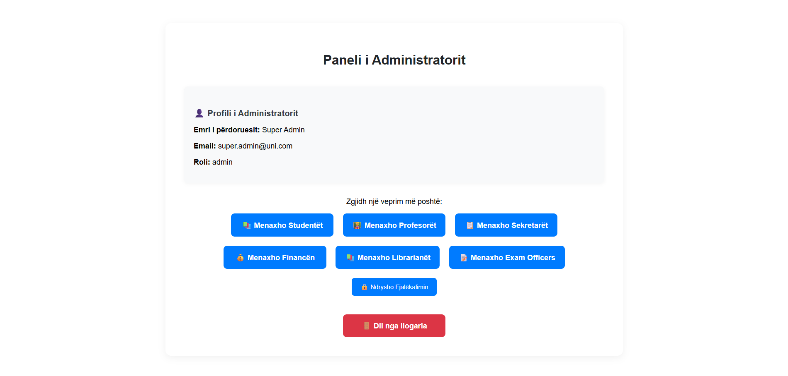
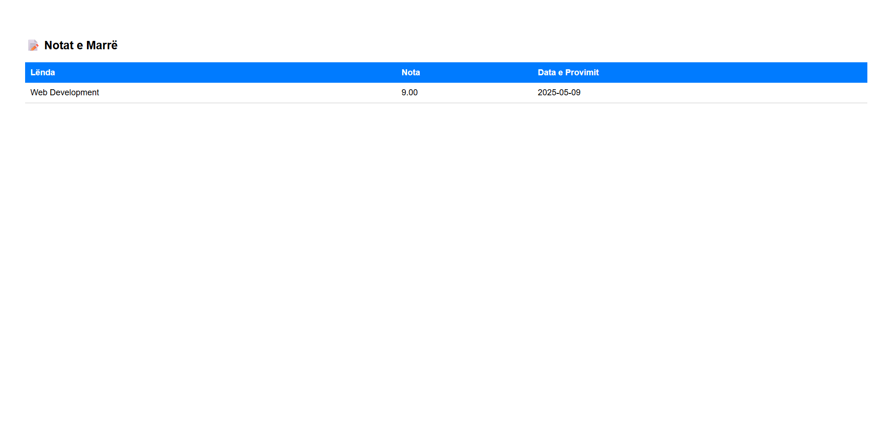
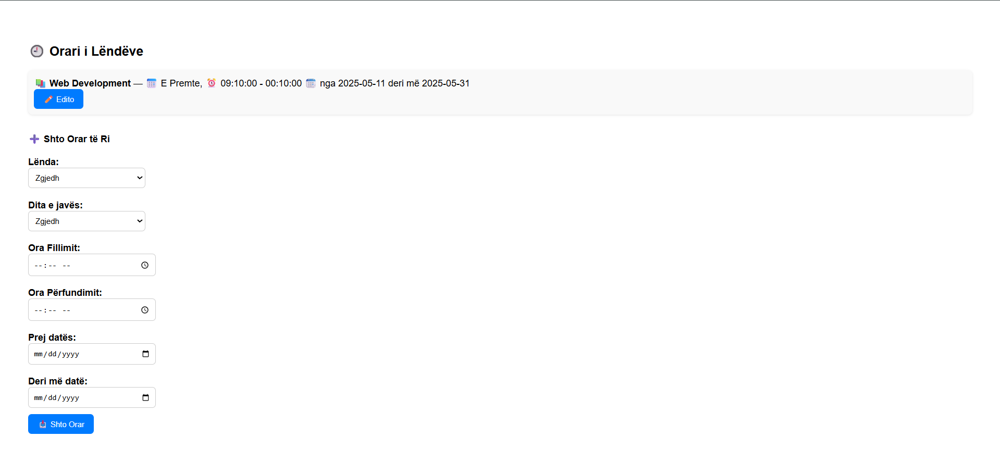
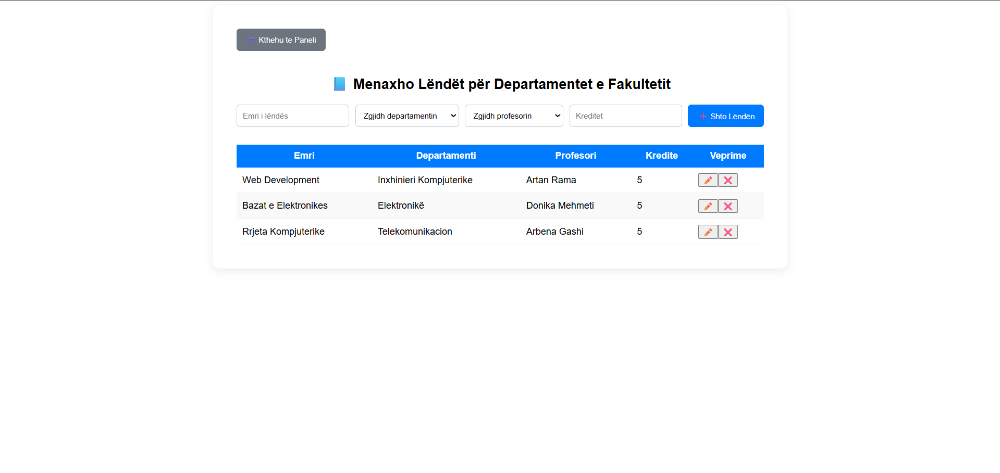

# University Management System

A distributed university management system built with **Django REST Framework** and **ReactJS**, designed to manage academic operations, roles, payments, library services, and more. This system implements secure role-based access, supports multi-tenancy, and offers API-level performance optimization.

---

## 📌 Overview

This project was developed as part of the course **Sistemet e Shpërndara 2025** at the **University of Prishtina**. It ensures the separation of frontend and backend, communicating solely through HTTP REST APIs in JSON format.

This platform simulates a real-world academic administration system, where different roles interact securely with centralized services in a distributed environment. It can be extended for use in universities, colleges, or any educational institution.

---

## 🚀 Technologies Used

### Backend:
- Django 5.x
- Django REST Framework
- drf-yasg (Swagger)
- MySQL
- JWT (SimpleJWT)
- Django CORS Headers
- Django Signals

### Frontend:
- ReactJS (bootstrapped with [Create React App](https://github.com/facebook/create-react-app))
- Axios
- Formik + Yup
- Context API (AuthContext)

### Development Tools:
- Visual Studio Code
- Postman (API testing)
- Git & GitHub (Version Control)
- MySQL Workbench
- Swagger UI (API Documentation)

---

## 🏗️ System Structure – `university-management`

This document presents a **professional and organized folder structure** of the `university-management` project, with detailed explanations for each major component.

---

## 🌐 Root Directory

```
university-management/
├── manage.py                  # Django management command entry point
├── backend/                  # Project-level Django configuration (not an app)
│   ├── settings.py           # Core project settings (DB, JWT, CORS, etc.)
│   ├── urls.py               # URL routing for all included apps
│   ├── asgi.py / wsgi.py     # Deployment interface files
│   └── __init__.py           # Marks this folder as a Python package
│   └── __pycache__/          # Auto-generated bytecode cache
```

---

## 🧠 Main Django App – `university/`

```
university/
├── admin.py                  # Admin interface configuration
├── apps.py                   # App definition
├── models.py                 # All database models (Student, Professor, etc.)
├── serializers.py            # Converts models to JSON (DRF serialization)
├── views.py                  # All logic and endpoints (CRUD, etc.)
├── permissions.py            # Custom permission logic by role
├── mixins.py                 # Shared helper classes for DRY logic
├── urls.py                   # Internal API routing for this app
├── tests.py                  # App-specific unit tests
├── __init__.py               # Python package marker
├── migrations/               # Database schema changes
│   ├── 0001_initial.py
│   ├── 0002_alter_*.py
│   └── __init__.py
│   └── __pycache__/
└── __pycache__/              # Precompiled app files
```

---

## 🎨 Frontend – ReactJS

```
frontend/
└── src/
    ├── App.js / App.css              # Root React component and its style
    ├── index.js / index.css          # Entry point and global styles
    ├── context/
    │   └── AuthContext.js            # JWT authentication context (login, token)
    └── components/                   # All UI components grouped by role
        ├── LoginForm.js
        ├── ProtectedRoute.js
        ├── ChangePasswordForm.js

        ├── AdminDashboard.js
        ├── StudentDashboard.js
        ├── ProfessorDashboard.js
        ├── ExamOfficerDashboard.js
        ├── FinanceDashboard.js
        ├── SecretaryDashboard.js
        ├── LibrarianDashboard.js

        ├── AdminSrc/
        │   ├── StudentManagement.js
        │   ├── ProfessorManagement.js
        │   ├── LibrarianManagement.js
        │   ├── FinanceManagement.js
        │   └── SecretaryManagement.js

        ├── ExamSrc/
        │   └── ExamManagement.js

        ├── FinanceSrc/
        │   ├── StaffPayment.js
        │   ├── StaffPaymentHistory.js
        │   ├── ScholarshipOpeningManager.js
        │   ├── ScholarshipApproval.js
        │   └── ScholarshipWinners.js

        ├── LibrarianSrc/
        │   ├── AddBook.js
        │   ├── AvailableBooks.js
        │   ├── BorrowedBooks.js
        │   └── LoanBook.js

        ├── ProfessorSrc/
        │   ├── AttendanceSection.js
        │   ├── GradeSection.js
        │   ├── ScheduleSection.js
        │   └── SubmissionsSection.js

        ├── SecretarySrc/
        │   ├── AddStudentBySecretary.js
        │   ├── ProfessorListForSecretary.js
        │   ├── StudentListForSecretary.js
        │   ├── SubjectManagementForSecretary.js
        │   ├── DepartmentManagementForSecretary.js
        │   ├── LibraryCreateSection.js
        │   └── ManageBuildings.js

        └── StudentSrc/
            ├── EnrollSubjectSection.js
            ├── ExamSubmissionSection.js
            ├── ScholarshipApplicationForm.js
            ├── StudentAttendanceSection.js
            ├── StudentGradesSection.js
            └── StudentScheduleSection.js
```

---

## ✅ Summary Table of Main Folders

| Folder            | Description                                                              |
| ----------------- | ------------------------------------------------------------------------ |
| `backend/`        | Django project setup (settings, URLs, deployment entry points)           |
| `university/`     | Main Django app with models, views, API logic, permissions               |
| `frontend/src/`   | React frontend setup with JWT context, routing, and UI                   |
| `components/*Src` | Logical grouping of UI sections per user role for modularity and clarity |

---

This structure ensures a clean, modular, and scalable codebase for managing university operations across various user roles. It follows best practices for full-stack development with Django and React.


---


## ⚙️ Installation Instructions

### Backend Setup:

```bash
cd university-management
python -m venv env
source env/bin/activate  # or env\Scripts\activate on Windows
pip install -r requirements.txt

# Create the database in MySQL
# Login to mysql and run:
# CREATE DATABASE university_db CHARACTER SET utf8mb4 COLLATE utf8mb4_unicode_ci;

python manage.py makemigrations
python manage.py migrate
python manage.py createsuperuser # (optional but recommended)
python manage.py runserver
```

> Ensure MySQL server is running and a database (e.g. `university_db`) is created.  
> Database credentials should be configured in `settings.py` or via `.env` variables.

### Frontend Setup:

```bash
cd frontend
npm install
npm start
```

> Runs the app in development mode: [http://localhost:3000](http://localhost:3000)

---

## 🔐 Authentication

- Authentication is handled via **JWT**, using email and password.
- Token endpoint: `/api/token/`

#### Sample Login Request:

```json
POST /api/token/
{
  "email": "student1@uni.com",
  "password": "Password123!"
}
```

- Roles include: `admin`, `student`, `professor`, `secretary`, `librarian`, `finance`, `exam-officer`.

---

## 📚 Core Features

### 🎓 Academic
- Manage Students, Professors, Subjects, Exams, Grades
- Student Enrollments and Submissions
- Schedule & Attendance tracking

### 💰 Finance & Scholarships
- Monthly salary payments for staff
- Scholarship creation, application and approval system

### 📘 Library
- Add books, loan books to students, return tracking
- Library and librarian managed per faculty

### 🏛️ Infrastructure
- Faculties, Departments, Buildings, Rooms

Each role logs into a separate dashboard where they can manage only what is allowed by their permissions. For example:
- A librarian manages books and loans.
- A finance user manages salaries and scholarships.
- A student can view grades, schedules, and apply for scholarships.

---

## 🧠 Advanced Features

### ✅ Multi-Tenancy (TenantFilterMixin)

Data is filtered based on the user's faculty. Secretaries, Professors, Students, etc., see only their own institution's data.

This is achieved using a shared `TenantFilterMixin` that automatically filters queries based on the user's role and linked faculty:

```python
def get_queryset(self):
    return self.get_tenant_queryset(Student.objects.all())
```

### 🚀 Caching

- Grades and student-grade views are cached for 15 minutes to boost performance.

### 📄 API Documentation

- Fully documented and testable via Swagger at `/swagger/`

### 🧪 Unit Tests

Sample unit and API tests implemented in `tests.py`, including login, model creation, and API behavior.

#### Example:

```python
from rest_framework.test import APITestCase

class AuthTests(APITestCase):
    def test_token_generation(self):
        response = self.client.post('/api/token/', {
            "email": "admin@uni.com",
            "password": "Admin123!"
        })
        self.assertEqual(response.status_code, 200)
```

---

## 🧭 API Endpoints Summary

| Endpoint | Method | Description |
|----------|--------|-------------|
| `/api/token/` | POST | Get JWT token |
| `/api/v1/students/` | GET, POST | List or add students |
| `/api/v1/grades/` | GET, POST | View or submit grades |
| `/api/v1/subjects/` | GET | List subjects by department |
| `/api/v1/scholarship-applications/` | GET, POST | Apply for scholarship |
| `/api/v1/payments/` | GET, POST | Staff payments |

---

## 📸 Screenshots

### 🧑‍💼 Admin Dashboard


All admin management buttons: students, professors, librarians, finance staff, secretaries.

### 🎓 Student Grades View


List of grades visible to a student after logging into their dashboard.

### 📘 Book Loan Panel


Librarian panel for issuing books to students.

### 💰 Finance – Scholarship Management


Finance officer’s view for managing and approving scholarship applications.

### 🧑‍🏫 Professor Attendance Screen


Attendance registration screen used by a professor for a scheduled class.

### 🏢 Secretary – Subject Management


Subject and department management interface used by a faculty secretary.

---

## 👥 Contributors

- **Mesud Hoxha** – [mesud.hoxha@student.uni-pr.edu](mailto:mesud.hoxha@student.uni-pr.edu)
- **Admir Rama** – [admir.rama@student.uni-pr.edu](mailto:admir.rama@student.uni-pr.edu)
- **Dielli Doçi** – [dielli.doci@student.uni-pr.edu](mailto:dielli.doci@student.uni-pr.edu)
- **Blerton Ismaili** – [blerton.ismaili@student.uni-pr.edu](mailto:blerton.ismaili@student.uni-pr.edu)

---

## 📂 Notes

- GitHub repository and PRs to be linked manually.
- Swagger and endpoints require valid authentication.
- For questions, refer to contributors or course instructors.

---

## 📋 Project Task Management

For project planning and task tracking, we used **Monday.com**, an online project management tool.  
Key tasks and development stages were organized and monitored throughout the project timeline.

🔗 [View Project Board on Monday.com](https://view.monday.com/1967370212-a10064b5a34c7430ff83369944f85d47?r=euc1)


📁 Code Repository: [Sistemet-e-Shperndara on GitHub](https://github.com/MesudHoxha/Sistemet-e-Shperndara.git)

---

> This system is developed as a complete academic prototype for educational purposes under the course "Sistemet e Shpërndara 2025" at FIEK – University of Prishtina.
